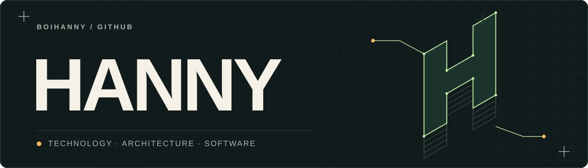
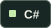

<picture>
  <source media="(prefers-color-scheme: dark)" srcset="./assets/hanny-banner-dark.svg">
  <source media="(prefers-color-scheme: light)" srcset="./assets/hanny-banner-light.svg">
  
</picture>

I’m a **technology strategist and solutions architect** with a background in hands-on software development, product management, and IT. I work on enterprise applications, workflow automation, and custom AI systems.

I like getting to the heart of a problem, choosing the right tools, and taking an idea through to a working product. That means thinking about the architecture, the data, and the person who has to use it.

  <b>Languages</b> 
  
  
  
  
  
  
  
  
  

  <b>Frameworks</b> 
  
  
  
  
  
  

  <b>AI &amp; data</b> 
  
  
  
  
  
  
  
  
  
  
  
  

  <b>Platforms &amp; tools</b> 
  
  
  
  
  
  
  
  
  
  
  

  <b>Product &amp; engineering</b> 
  
  
  
  
  
  
  

  <b>Security &amp; quality</b> 
  
  
  
  
  

## Current focus

I’m currently focused on **applied AI and agentic engineering**. As AI models have become more capable, they’ve become a regular part of my development process: helping me explore ideas, work through difficult problems, and build more ambitious software.

I use that to push the things I care about further: thoughtful architecture, secure systems, reliable automation, and interfaces that make sense to people. My programming experience guides the process, from setting the direction and giving agents the right context to reviewing code, testing behavior, and taking responsibility for what ships.

## What I work on

- **Software & architecture** · Enterprise applications, APIs, workflow automation, and desktop and web interfaces. Code review, testing, and maintainability are part of the work.
- **Applied AI & data** · Language and vision models, conversational AI, agents, custom model training and adaptation, OCR, structured extraction, and evaluation with confidence checks and human review.
- **Product & experience** · Product strategy, solution design, project delivery, and interfaces that make complex processes easier for people to use.
- **Cloud & operations** · Azure, DevOps, Microsoft 365, on-premises and cloud IT, and secure data handling.

<b>My wider toolkit</b>

- **Languages:** C#, C++, Python, TypeScript, JavaScript, PowerShell, HTML, CSS, XAML
- **Frameworks:** .NET, WPF, MAUI, Blazor, Angular, React
- **Platforms & tools:** Azure, Azure DevOps, Windows, Linux, Android, Unity, Blender, VRChat

## In my free time

I’m exploring interactive AI, Unity, and Blender, and continuing to develop **[MagicChatbox](https://github.com/BoiHanny/vrcosc-magicchatbox)**, my VRChat chatbox project. It brings together music, lyrics, status, and other optional integrations in a customisable chatbox.

[Explore MagicChatbox →](https://github.com/BoiHanny/vrcosc-magicchatbox)

## Let’s connect

